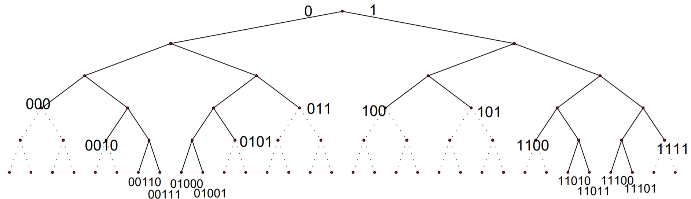

# Compression

La **compression de données** est l'opération consistant à **transformer** une donnée A en une autre B pouvant **restituer** les mêmes informations, ou des informations *"proches"*, en utilisant un algorithme de *décompression*.

C'est une opération dite de **codage** qui change la représentation des données visant à en **diminuer** la taille (de stockage) de celles-ci au prix d'un travail de compression (et de décompression pour la restitution des données).

## Types de compression

 Il existe deux types de compression de données:

- La compression **sans perte** restituant après décompression un signal (données) strictement identique à l'original avant compression. 
  On peut exploiter par exemple la redondance des données ou des a priori sur la source de données.
  (**Codage RLE,** **codage de Huffman**, **codage LZW** ...)

- A l'inverse, la compression **avec perte** restituant un signal différent, mais relativement *"proche"* du signal d'origine, mais permet une compression plus importante. On considère généralement la différence entre les deux signaux comme négligeable (non perceptible) et étant une perte acceptable dans certains cas pour que la source de données reste compréhensible/perceptible.
 On peut par exemple exploiter la perception humaine pour définir l'information négligeable (comme les hautes fréquences d'une image par exemple).

  (**sous échantillonnage**, **Codage par DTC**, **codage par ondelettes** ...)

## Taux de compression

Le taux de compression que l'on peut noter $\tau$ est relié au rapport entre la taille $b$ du fichier compressé $B$ et la taille $a$ du fichier original $A$. Le taux de compression est généralement exprimé en pourcentage et est défini par :

$$
\tau = 1 - (b/a)
$$

**Exemple :** $a$ = 550 Mo,  $b$=250 Mo , $\tau = 1 - (250/550) = 54\%$

L'algorithme utilisé cherche généralement à obtenir un taux de compression inférieur à 1.

## Entropie de Shannon

L'**entropie de Shannon**, crée par Claude Shannon, est une fonction mathématique qui permet de quantifier la quantité d'information contenue par une source d'information. Cette source peut être un texte écrit dans une langue donnée, un signal électrique ou encore un fichier informatique quelconque.

Autrement dit, l'entropie de Shannon indique la **quantité d'information nécessaire** pour que l'on puisse déterminer sans ambiguïté ce que l'on perçoit d'une source de données. 
En particulier, plus la source est redondante, moins elle contient d'information. Par exemple, si une source envoie toujours le même symbole, par exemple la lettre 'a', alors son entropie est *nulle*, c'est-à-dire minimale, car l'on peut identifier sans aucune connaissance et sans ambiguïté le prochain symbole émis par la source. En l'absence de contraintes particulières, l'entropie est maximale pour une source dont tous les symboles sont équiprobables.

### Définition

Pour une source, qui est une variable aléatoire discrète $X$ comportant $N$ symboles distincts, chaque symbole $x_i$ ayant une probabilité $P_i$ d'apparaître. Les symboles représentent les réalisations possibles de la variable aléatoire $X$.
L'**entropie** $H$ de la source $X$ est définie comme :

$$
H_b(X) = -\mathbb{E}[log_b(P(X))] = -\sum_{i=1}^N P_i.log_b(P_i)
$$

Où $\mathbb{E}$ désigne l'espérance mathématique et $log_b$ le logarithme en base *b*. 
On utilise en général un logarithme à base 2, car l'entropie s'exprime alors en nombre de bits par symbole. Dans ce cas, on peut interpréter $H(X)$ comme le nombre de questions à réponse binaire que l'on doit poser en moyenne à la source, ou la quantité d'information en bits que la source doit fournir au récepteur pour que ce dernier puisse déterminer sans ambiguïté la valeur de $X$.

$$
H(X) = H_2(X) = -\sum_{i=1}^N P_i.log_2(P_i)
$$

### Interprétation

Dans le cas où l'on dispose d'un nombre $N$ de symboles de la forme $N= 2^n$ avec $n$ entier et où les $N$ symboles sont équiprobables, il suffit de $n$ questions, en procédant par dichotomie, pour déterminer le symbole envoyé par la source. Dans ce cas, la quantité d'information contenue par le symbole est exactement $n = log_2(N)$.

$$
\begin{align}
H(X) =& -\sum_{i=1}^N P_i.log_2(P_i) \\
	 =& -\sum_{i=1}^N \frac{1}{N}.log_2(\frac{1}{N}) \\
	 =& -\frac{1}{N} \sum_{i=1}^N log_2(\frac{1}{N}) \\
	 =& -\frac{1}{N} * N.log_2(\frac{1}{2^n}) \\
	 =&\quad log_2(2^n) = n\\
\end{align}
$$

De manière plus générale, il est naturel de conserver cette formule dans le cas où $N$ n'est pas une puissance de 2. Par exemple, si les symboles sont les lettres de l'alphabet et que l'on les considère toutes équiprobables, alors l'information contenue par un symbole est $log_2(26) \approx 4.7$ .
Cette valeur est une valeur intermédiaire entre 4 bits (permettant de coder 16 symboles) et 5 bits (qui permet d'en coder 32).

### Exemple

Considérons une urne contenant des boules de 4 couleurs différentes: rouge, bleue, jaune et vert, toutes équiprobables.
On tire une boule au hasard et il s'agit d'en identifier la couleur. Comme aucun tirage n'est privilégié, l'entropie est ici maximale égale à  $log_2(4)=2$. 
Si on convient que les couleurs sont codées respectivement $00$, $01$, $10$, $11$, l'information contenue dans le tirage correspond effectivement à 2 bits.

Mais si une certaine couleur est plus représentée que les autres, alors l'entropie est légèrement réduite. Supposons par exemple que l'urne contienne 4 boules rouges, 2 bleues, 1 jaune et 1 verte. 

On peut calculer l'entropie de la manière suivante:

$$
\begin{align}
H(X) =& -\sum_{i=1}^N P_i.log_2(P_i) \\
	 =& -\left( \frac{4}{8}.log_2(\frac{4}{8}) + \frac{2}{8}.log_2(\frac{2}{8}) + \frac{1}{8}.log_2(\frac{2}{8}) + \frac{2}{8}.log_2(\frac{1}{8})\right) \\
	 =& -\left( \frac{log_2(\frac{1}{2})}{2} + \frac{log_2(\frac{1}{4})}{4} + \frac{log_2(\frac{1}{8})}{8} + \frac{log_2(\frac{1}{8})}{8}\right) \\
	 =& \quad \frac{log_2(2)}{2} + \frac{log_2(4)}{4} + \frac{log_2(8)}{8} + \frac{log_2(8)}{8} \\
	 =& \quad \frac{1}{2} + \frac{2}{4} + \frac{3}{8} + \frac{3}{8} \\
	 =& \quad \frac{7}{4} = 1.75
\end{align}
$$

Si les couleurs sont codées respectivement $0$ pour le rouge, $10$ pour le bleu, $110$ pour le jaune et $111$ pour le vert, alors l'information sur la couleur tirée occupe 1 bit une fois sur deux, 2 bits une fois sur quatre et 3 bits une fois sur quatre, soit en moyenne 7/4 bits, correspondant à l'entropie calculée.

## Codage de Huffman

Le **codage de Huffman** est un algorithme de compression de données **sans perte**. Il consiste à utiliser un code à longueur variable pour représenter un symbole d'une source de données en ayant une connaissance préalable (ou une estimation) des probabilités d'apparition des symboles de cette source. Un code court étant associé aux symboles les plus fréquents.

Un code de Huffman est optimal au sens de la plus courte longueur pour un codage par symbole et une distribution de probabilité connue. Des méthodes plus complexes réalisant une modélisation probabiliste de la source permettent d'obtenir de meilleurs ratios de compression.

### Code Préfixe

Soit $C$ un code.
Il est dit **code préfixe** si aucun mot du code n'a pour préfixe un autre mot du code ou autrement dit, si aucun mot de ce code n’est le début d’un autre mot de code.

Contre exemple :
Soit $X = \{a, b, c, d\}$ un ensemble de symbole.
On considère le code $C$ suivant  ($x \in X$) :

$$
C(x) = \left\{
\begin{array}{rl}
01 &:\; x = a  \\ 
010 &:\; x = b \\
111 &:\; x = c \\
11 &:\; x = d
\end{array}
\right.
$$

Le codage $010111$ peut alors s'interpréter de deux façons : $a\;a\;d$ ou $b\;c$.
Ce code **possède plusieurs interprétations**, il n'est pas préfixe, car le code du symbole $d$ est le début du code du symbole de $c$.

**Remarque :** À un code préfixe $C$ nous pouvons toujours associer un arbre binaire, où tous les mots de code se situent sur les feuilles de l’arbre.
$C(X ) = \{000, 100, 101, 0010, 0101, 1100, 1111, 00110, 00111, 01000, 01001, 11010, 11011, 11100, 11101\}$

**Remarques:**

- Autre mot de code ne peut être trouvé dans les sous-arbres qui ont comme racine un mot de code (les branches en pointillé dans la Figure).
- Soit $n$ niveau n de l’arbre binaire. Le nombre maximal de mots de code de longueur $n$ est $2^n$.
- Le nombre de descendants au niveau $n$ d’un nœud du niveau $m$ tel que $m ≤ n$ est $2n−m $.

### Principe

> TODO: expliquer la méthode, probabilités, construction de l'arbre et décodage

### Inégalité de Kraft

Soient $X = \{x_0, x_1, \dots, x_n \}$ une source et $C$ un code uniquement décodable (préfixe) de $X$ sur un alphabet de taille $\tau$.  on note $l_i = l(C(x_i))$ la longueur du code représentant le symbole $x_i$ dans le codage $C$. Alors on a : 

$$
\sum_{x \in X} \tau^{- l(C(x))} \leq 1
$$

De manière moins générique, pour un codage $C$ binaire (d'alphabet de taille $\tau = 2$) alors on a :

$$
\sum_{x \in X} 2^{-l(C(x))} = \sum_{i=1}^n 2^{-l_i} \leq 1
$$

**Demonstration : ** ( $\tau = 2$ pour plus de clarté)

>  La démonstration est faite en considérant $\tau = 2$ par simplicité mais peut se généraliser facilement.

Si le code préfixe, on peut faire une démonstration simple par analogie avec son graphe.
Notons la taille maximum d'un mot dans notre codage $C$ :  $l_{max} = Max(l_i)_{i \in [\hspace{-0.1em}[ 1, n ]\hspace{-0.1em}]}$  
(dans le graphe ci-dessus $l_{max} = 5$)
Comme ce code est préfixe, il existe des zones interdites pour placer les différents symboles comme expliqué précédemment. 

Si on se place sur une feuille quelconque de l'arbre représentant notre code préfixe, alors il y a $2^{(l_{max}-l_i)}$ descendants inaccessibles entre ce nœud et le niveau max. L'arbre complet de $l_{max}$ niveaux  possède  $2^{l_{max}}$ feuilles.  La somme des descendants inaccessibles doit donc naturellement être inférieure au nombre maximal de descendants.

$$
\sum_{i=1}^n 2^{l_{max}- l_i} \leq 2^{l_{max}}
$$

ce qui donne naturellement après simplification: 

$$
\sum_{i=1}^n 2^{-l_i} \leq 1
$$

> Remarque : 
> Le codage est optimal lorsque qu'il y a égalité 

*Bonus :* La réciproque est vrai !

### Théorème de Kraft-McMillan

Soit ${n(x) > 0, x \in X }$, des entiers positifs qui vérifient l’inégalité de Kraft-McMillan):

$$
\sum_{x \in X} 2^{- n(x)} \leq 1
$$

 Alors, *il existe un code de préfixe* $C$ avec une longueur $l(x) = n(x)$ (qui est donc nécessairement uniquement décodable.)

### Longueur moyenne

Soient $X = \{x_0, x_1, \dots, x_n \}$ une source, $p_i = p(x_i) = \mathbb{P}(X = x_i)$ la probabilité d'apparition du caractère $x_i$ et $C$ un codage de Huffman associé à $X$.
Il est possible d'exprimer la longueur moyenne de ce codage via la formule: 

$$
\mathbb{L}(C) = \sum_{x\in X} p_i.l(C(x)) = \sum_{x\in X} p_i.l_i
$$

### Limitations du codage de Huffman

#### Théorème de Shannon

La longueur moyenne de tout code préfixe $\mathbb{L}(C)$ d'alphabet de taille $\tau$ pour la source $X$ est supérieure ou égale à l'entropie de la source: 

$$
H_\tau(X) \leq \mathbb{L}(C)
$$

De plus, il est possible de montrer qu'il existe un code préfixe $C$ qui code $X$ avec une longueur moyenne à moins d’un bit de son entropie :

$$
\mathbb{L}(C) \leq H_\tau(X) +1
$$

Pour résumer, On peut montrer que pour une source $X$ d'entropie de Shannon $H(X)$ la longueur moyenne $\mathbb{L}(C)$ d'un mot de code obtenu par codage de Huffman $C$ de $X$ vérifie:

$$
H(X) \leq \mathbb{L}(C) \leq H(X) +1
$$

----

**Demonstration $H_\tau(X) \leq \mathbb{L}(C)$: ** ( $\tau = 2$ pour plus de clarté)

$$
\begin{align}
\mathbb{L}(C) - H(X) =& \sum_{i=1}^n p_i.l_i + \sum_{i=1}^n p_i.log_2(p_i) \\
=& \sum_{i=1}^n p_i.-1.(-l_i) + \sum_{i=1}^n p_i.log_2(p_i) \\
=& -\sum_{i=1}^n p_i.log_2(2^{-l_i}) + \sum_{i=1}^n p_i.log_2(p_i) \\
\end{align}
$$

Posons une nouvelle distribution de probabilité normée (de somme égale à 1) de $X$ :

$$
q(x_i) = q_i = \frac{2^{-l(C(x))}}{\sum_{i=1}^n2^{-l(C(x))}}= \frac{2^{-l_i}}{\sum_{i=1}^n2^{-l_i}} = \frac{2^{-l_i}}{S}
$$

où on pose $S = \sum_{i=1}^n2^{-l_i}$

ainsi on a : 

$$
\begin{align}
\mathbb{L}(C) - H(X) =& -\sum_{i=1}^n p_i.log_2(S.q_i) + \sum_{i=1}^n p_i.log_2(p_i) \\
=& -\sum_{i=1}^n p_i.(log_2(S) + log_2(q_i))+ \sum_{i=1}^n p_i.log_2(p_i) \\
=& -\sum_{i=1}^n p_i.log_2(S) -\sum_{i=1}^n p_i.log_2(q_i) + \sum_{i=1}^n p_i.log_2(p_i) \\
=& -log_2(S)\sum_{i=1}^n p_i + \sum_{i=1}^n p_i.(log_2(p_i)- log_2(q_i)) \\
=& -log_2(S) + \sum_{i=1}^n p_i.log_2(\frac{p_i}{q_i}) \\
\end{align}
$$

Remarquons que, comme $S = \sum_{i=1}^n2^{-l_i}$, $S$ est une grandeur inférieure à 1 étant donné l'inégalité de Kraft. Le logarithme de $S$ est donc négatif, précédé d'un moins, i.e : $-log_2(S) \geq 0$.

Le terme de droite correspond à la définition d'entropie relative : 

$$
D(p||q) = \sum_{i=1}^n p_i.log_2(\frac{p_i}{q_i})
$$

Il est possible de montrer que l'entropie relative est une grandeur positive.

> Inégalité de Jensen
>
> Soit $f$ une fonction convexe, f $\mathbb{R}^n \to \mathbb{R}$  et $X$ un vecteur aléatoire $X \in \mathbb{R}^n$ avec une loi de probabilité $p$ alors :
> $$
> \mathbb{E}_p[f(x)] \geq f(\mathbb{E}_p[x])
> $$
> 
> 
>---
> 
>$$
> D(p||q) = \sum_{i=1}^n p_i.log_2(\frac{p_i}{q_i}) = \sum_{i=1}^n p_i.-log_2(\frac{q_i}{p_i}) = \mathbb{E}_p[-log_2(\frac{q(x)}{p(x)})]
> $$
> 
>
>Comme $-log(.)$ est convexe,
> 
> $$
> \begin{align}
> D(p||q) \geq& -log_2(\mathbb{E}_p[\frac{q(x)}{p(x)}]) \\
> \geq& -log_2(\sum_{i=1}^n p_i.\frac{q_i}{p_i}) \\
> \geq& -log_2(\sum_{i=1}^n q_i) \\
> \geq& -log_2(1) = 0 \\
> \end{align}
> $$
> 
> Finalement on a bien
> 
> $$
> D(p||q) \geq 0
> $$
> 
>Les deux termes sont alors positifs et on a donc : 
> 
> $$
> \mathbb{L}(C) - H(X) \ge 0 \\
> \mathbb{L}(C) \geq H(X)
> $$
> 

---

**Démonstration $\mathbb{L}(C) \leq H_\tau(X) +1$: ** ( $\tau = 2$ pour plus de clarté)

Soient $X = \{x_0, x_1, \dots, x_n \}$ une source, $p_i = \mathbb{P}(X = x_i)$ la probabilité d'apparition du caractère $x_i$ .

Commençons par démontrer qu'il existe un code dont les longueurs $l_i$ sont égales à :

$$
l_i = l(C(x_i)) = \lceil log_2(\frac{1}{pi})\rceil
$$

Pour $x\geq 0$ ,on sait que $x \leq \lceil x\rceil \leq x + 1$

$$
\begin{array}{ccc}
x &\leq& \lceil x\rceil \\
-\lceil x\rceil &\leq& -x \\
\end{array}
$$

Comme  $x \geq 0$ on peut élever à la puissance 2

$$
2^{-\lceil x\rceil} \leq\; 2^{-x}
$$

En remplaçant  $x$ par $log_2(\frac{1}{p_i})$ on obtient: 

$$
\sum_{i=1}^n 2^{-\lceil log_2(\frac{1}{p_i}) \rceil} \leq \sum_{i=1}^n 2^{- log_2(\frac{1}{p_i})} = \sum_{i=1}^n p_i = 1
$$

Alors d'après le Théorème de Kraft-McMillan il existe un code $C$ préfixe dont les longueurs sont égales à $l_i = l(C(x_i)) = \lceil log_2(\frac{1}{pi})\rceil$

Calculons la longueur moyenne de ce code :

$$
\begin{align}
\mathbb{L}(C) =& \sum_{i\in n} p_i.l_i \\
=& \sum_{i\in n} p_i\lceil log_2(\frac{1}{pi})\rceil \\
\leq& \sum_{i\in n} p_i(log_2(\frac{1}{pi})+1) \\
\leq& -\sum_{i\in n} p_i.log_2(p_i) + \sum_{i\in n}p_i \\
\leq& H(X) + 1 \\
\end{align}
$$

## Codage RLE

Le **run-length encoding**, est un algorithme de compression de données sans perte en informatique.

L'idée général est de considérer, pour une source de données $X$, les répétitions successives de ses symboles. Cela consiste à remplacer les suites de caractères identiques par ce caractère suivi du nombre de répétition de celui-ci. Par exemple, pour la suite de suivante : 

> A C F X X X X C C U U U D C C C C C

Le codage **RLE** deviens : 

> 1 A 1 C 1 F 4 X 2 C 3 U 1 D 4 C

Cela peut s'écrire plus efficacement directement avec le symbole lorsque celui-ci n'est présent qu'une fois (on obtient alors toujours au maximum la même taille) :

> A C F 4 X 2 C 3 U D 4 C

Car cela peut mener à une suite de symbole plus longue dans le cas contraire : 

> WBWBWBWBWB

devient sans cette astuce :

>  1W1B1W1B1W1B1W1B1W1B
