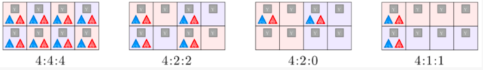
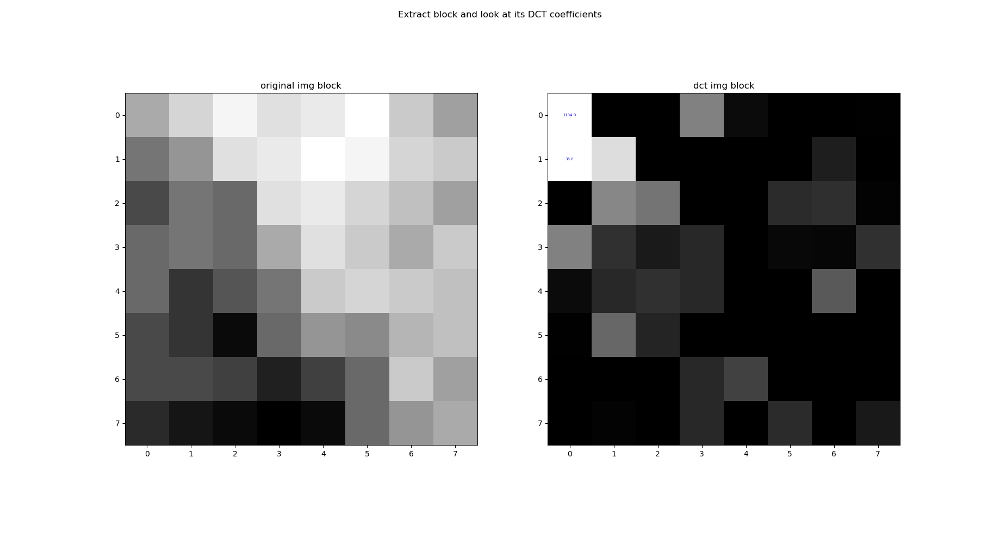
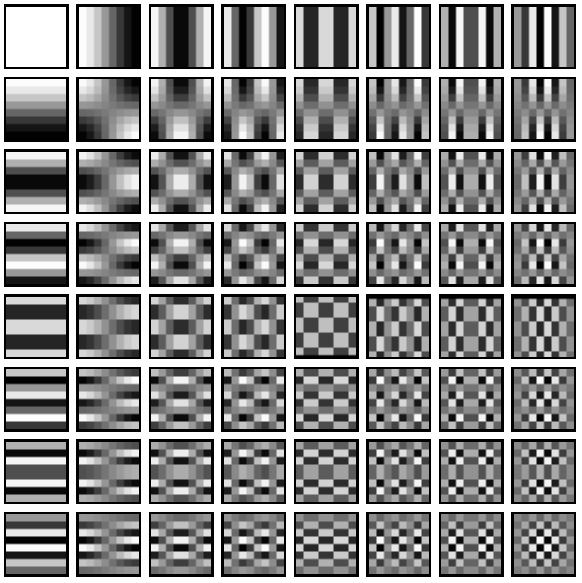
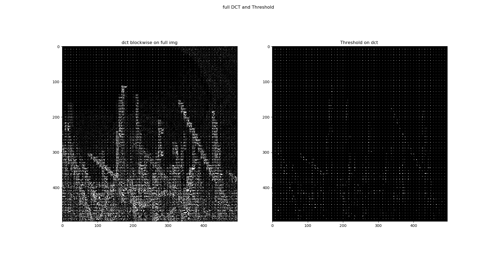
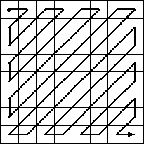

# Le cas du JPEG

Grâce au développement du numérique, les échanges de données, et plus particulièrement des images, sont de plus en plus présent autour de nous. 

Le stockage et la rapidité de transmission sont devenus deux enjeux majeurs avec l'émergence de flux de données de plus en plus présent. Il est donc naturel de se demander comment les images sont stockées et transmises. 

C’est là qu'intervient la compression et le traitement numérique. Il s'agit en effet de trouver la manière la plus optimisée de représenter les données à l'aide d’algorithmes afin que la représentation compressée soit plus courte que la représentation originale, pour pouvoir ensuite stocker l’information en occupant le moins d'espace et/ou la transmettre rapidement. 

Il existe deux grandes familles de compression des données comme vu précédemment : la compression sans pertes qui conserve l’intégralité des informations et la compression avec pertes qui permet d’obtenir de bien meilleurs résultats mais qui altère les données d’origine. 

Nous allons donc nous intéresser à la norme de compression JPEG (Joint Photographic Experts Group) qui illustre bien les différentes étapes de compression d’une image et qui fait appel à des processus avec et sans pertes précédemment évoqués.

## L'image numérique

De nos jours, les images numériques sont partout, sur nos téléphones, nos ordinateurs et même les affiches publicitaires. Mais bien qu'utilisées de partout, il semble pertinent de revenir rapidement sur ce qu'est réellement une image numérique.

Une image numérique est une représentation **discrète** d'une image classique dit continue obtenue via un convertisseurs analogique-numérique comme une *matrice de Bayer* par exemple pour la majorité des appareils photos numériques de nos jours. L'idée est de stocker un nombre fini de points codant l’**information lumineuse** (intensité et couleur généralement) représentant l'image.

Dans le cas des images à deux dimensions (le plus courant), elle est représentée par une matrice 2D(ou 3D en fonction du nombre de canal de couleurs) et donc chaque élément est appelés pixels.
La  **définition**  d'une image est définie par le nombre de points composant la matrice. En image numérique, cela correspond au nombre de pixels qui composent l'image en hauteur (axe vertical) et en largeur (axe horizontal) :  exemple 200 pixels par 450 pixels.
La  **résolution**  d'une image est définie par un nombre de pixels par unité de longueur de la structure à numériser. Plus la résolution est élevée, plus le nombre de points est important.

Il existe plusieurs modes de codage pour représenter les couleurs pour chaque pixels, le plus utilisé pour le maniement des images est l'espace colorimétrique rouge, vert, bleu ou **RVB**  ou **RGB** (de l'anglais red-green-blue). Cet espace est basé sur une synthèse additive des couleurs, c'est-à-dire que le mélange des trois composantes R, V, et B à leur valeur maximum donne du blanc, à l'instar de la  lumière. Le mélange de ces trois couleurs à des proportions diverses permet de reproduire à l'écran une part importante du spectre visible, sans avoir à spécifier une multitude de fréquences lumineuses.

Mais il existe d'autres modes de représentation des couleurs appelés ***espaces colorimétriques*** (dont nous reparlerons plus tard) :

-   **CMJN** (**CMYK**) cyan, magenta, jaune, noir utilisé principalement pour l'impression, et basé sur une  synthèse soustractive des couleurs
-   **TSL** (**HSL**) pour teinte, saturation, luminance
-   **YUV** où Y représentant la luminance, U et V deux chrominances

Ensuite, le codage de la couleur peut être réalisé de différentes manières.

Il peux par exemple être représenter en utilisant trois octets par pixels représentant la valeur d'une composante de couleur par un entier de 0 à 255 (ces trois valeurs codent généralement la couleur dans l'espace **RVB**) , soit qu'un seul octet (8 bits) par pixels si l'image ne représente que l'intensité lumineuse (image en Noir et blanc par exemple).

Avec 8 bits par couleurs, le nombre de couleurs différentes pouvant être ainsi représenté est de 256 × 256 × 256 possibilités, soit environ 16,7 millions de couleurs.

Le nombre de bits utilisés pour représenter la couleurs d'un pixel est appelée la **profondeur de couleurs** et sont l'unité est le bits par pixel (**bpp**).

Une plus grande profondeur de couleurs, ce qui nécessite un plus grand nombre de bits, permet une plus grande échelle de nuances dans les couleurs.

Il existe bien entendu une multitude de  profondeur de couleurs différentes du 16bits en passant par du 32bits mais inutile de rentrer dans le détails ici.

Parfois, une  palette de couleurs appelée look-up table ou LUT peut être utilisée pour stocker une image représentée avec moins de couleurs (256 couleurs) mais nous nous attarderons pas sur ce type de stockage.

## Transformation : espace de couleurs

Il existe plusieurs manières de représenter les couleurs d’une image, soit par les trois composantes ***Rouge, Vert et Bleu*** de la synthèse additive d’une couleur (représentation RGB), soit par une représentation circulaire des couleurs où l’on représente trois composantes de ***teinte***, de ***saturation***, et de ***luminance*** d’une couleur (représentation TSL). Enfin il est également possible de représenter d’abord la luminance (signal en niveau de gris) et par la suite les deux chrominances, qui représentent chacune une différence de couleur par rapport à la luminance respectivement **U** ou **Cb** pour la différence avec le bleu (B-Y) et **Y** ou Cr pour la différence avec rouge (R - Y). Il est donc possible de passer de RGB a YUV (**YCbCr**) via les calculs suivants:

$$
\begin{equation}
	\begin{bmatrix}
	Y \\ U \\ V
	\end{bmatrix}
	=
	\begin{bmatrix}
	0,299 & 0,587 & 0,114\\
	-0,14713 & -0,28886 & 0,436\\
	0,615 & -0,51498 & -0,10001
	\end{bmatrix}
	.
	\begin{bmatrix}
	R \\ G \\ B
	\end{bmatrix}
\end{equation}
$$

$$
\begin{equation}
	\begin{bmatrix}
	R \\ G \\ B
	\end{bmatrix}
	=
	\begin{bmatrix}
	1 & 0 & 1,13983 \\
	1 & -0,39465 & -0,58060  \\
	1 & 2,03211 & 0
	\end{bmatrix}
	.
	\begin{bmatrix}
	Y \\ U \\ V
	\end{bmatrix}
\end{equation}
$$

L’intérêt d’une telle transformation est que la vision humaine présente une **sensibilité moindre** à la couleur qu’à la luminosité. On va donc pouvoir **sous échantillonner** les composantes de chrominance sans affecter fortement la qualité du rendu final de l’image.

## Sous-échantillonnage de la chrominance

L'œil humain est beaucoup plus sensible aux variations de lumière qu’à celles de couleur. Ainsi afin de pouvoir permettre un meilleur taux de compression, il est possible de **réduire la répétition** entre les informations de couleurs. 

On fait donc appel au **sous-échantillonnage de chrominance**. Cela va donc permettre de réduire la résolution spatiale c’est-à-dire réduire la quantité d’information sur une même surface. On peut ainsi se demander comment cela fonctionne. 

Le procédé reste relativement simple. En effet il repose sur la **suppression de paires (Cb;Cr)** ou (U;V) de certains pixels de l’image. Toutefois, il est nécessaire de choisir le mode de sous-échantillonnage parmi ceux utilisés en JPEG : le mode 4:2:0, 4:2:2 ou le mode 4:4:4.

Chaque triplet se décompose ainsi en trois nombres (J : a : ​b) correspondant chacun à une information sur le bloc. On considérera ici un bloc comme étant une région de quatre pixels de largeur sur 2 pixels de hauteur. 

Le nombre **J** représente le nombre d’échantillons de luminance par ligne ou encore la largeur du bloc pour le traitement de la chrominance. Ici au vue de la définition que nous avons donnée du bloc on peut ici considérer que J vaut 4. 

Le nombre **a** représente le nombre d’échantillons de chrominance (Cb, Cr) dans la première ligne tandis que b représente celui de la deuxième ligne.

Ainsi, en s’intéressant de plus près au schéma, on peut voir l’évolution du bloc, selon les différents modes de sous échantillonnage appliqués. 

- On peut donc voir qu’en commençant par la gauche, le premier mode 4:4:4 correspond au mode où aucune altération n’a été réalisée. Nous sommes donc dans le cas de notre image d’origine. Chaque case possède bien une information de luminance (carré gris Y) ainsi que les deux informations de chrominances (triangles bleu Cb et rouge Cr).

- Dans le second mode 4:2:2, les informations de luminances sont conservées, mais on ne conserve que deux couples d’informations de chrominance sur les quatre de chaque ligne. Les deux composantes de chrominance sont donc échantillonnées à la moitié de la fréquence d'échantillonnage de luminance. Les pixels ne contenant pas d’informations de chrominances sont affichés lors du décodage avec une moyenne des valeurs gauche et droite. 
- Dans le troisième mode **4:2:0**, seules deux des couples d’informations de chrominances de la première ligne sont conservées. Pour retrouver les informations perdues, on procédera de la même manière que dans le mode précédent en moyennant les valeurs manquantes lors du décodage. 
- Le dernier mode **4:1:1** est peu utilisée voire jamais dans le cas du JPEG.

Grâce à cette méthode, le nombre d’échantillons contenu dans l’image diminuant, le volume de l’image traitée diminue aussi permettant donc d’obtenir une image moins conséquente en terme de taille sans pour autant la dégrader de façon trop visible pour l'œil humain.

## Passage en fréquence : Transformation en cosinus discrètes

Jusqu’à présent, on a juste transformé le mode de couleur en **YUV** ou **YCbCr** et appliqué un sous-échantillonnage sur les composantes de la chrominance. Nous allons à présent appliquer la DCT à l’image.

Considérons ici par simplicité pour les explications une unique couche, la luminance.

A l’image d’une transformée de Fourier, il est possible d’appliquer une **transformée en cosinus discrète TCD ou DCT** à un signal/image. Cela permet de représenter l’image sous forme de “fréquences”.

La DCT et en particulier la DCT-II est très utilisée en traitement du signal. L'intérêt d'une telle transformation en fréquence se voit particulièrement bien sûr l’image suivante (un échantillon de taille 8x8 de notre image) : 

A gauche un bloc de notre image et à droite le calcul des coefficients de la DCT-II . On voit clairement ici que les coefficients de grande importance pour reconstituer l’image se concentrent en haut à gauche (les coefficients dit de *basses fréquences*).

L’idée de la compression par DCT est de conserver uniquement les quelques coefficients important (basses fréquences) non nuls utiles pour reconstruire la majorité de l’image et annuler les autres petites valeurs par quantification (c’est une opération analogue à l’application d’un filtre passe bas).

La DCT-II s’applique en 2D via la formule suivante : (sur un bloc de taille $M\times N$)

$$
DCT[i, j] = \frac{2}{\sqrt{MN}} C(i)C(j)\sum^{N-1}_{x=0}\sum^{M-1}_{y=0} pixel[x, y].cos(\frac{\pi i}{2N}.(2x+1)).cos(\frac{\pi j}{2M}.(2y+1))
$$

avec :

$$
C(x) = \left\{
\begin{array}{rl}
\frac{1}{\sqrt{2}} & \text{si } x = 0  \\ 
1 & \text{sinon} \\
\end{array}
\right.
$$

$\frac{2}{\sqrt{MN}}$ , $C(i)$ et $C(j)$ sont des facteurs qui permettent de rendre la transformation orthogonale car cette forme normalisée est très utilisée en pratique.

L'application de la DCT est une opération **théoriquement sans perte d'informations** ; les coefficients initiaux peuvent être retrouvés en appliquant la « DCT inverse » au résultat de la DCT. Dans la pratique, une certaine perte d'informations reste cependant possible en raison des erreurs d'arrondis introduites en cours de calcul.

---

À chaque bloc de $N \times N$ pixels sont ainsi associés $N \times N$ fréquences.

Celle-ci est appliquée sur les deux axes de l’image 2D, ci-dessous une représentation des différentes fréquences ainsi obtenue sur les deux axes.

## Quantification

L'œil humain distingue difficilement les zones de hautes fréquences, il est donc envisageable de **réduire l’importance de ces zones de hautes fréquences** sur l’image considérée.

Ainsi cette opération permettra également de réduire la place mémoire nécessaire pour le stockage de l’image en question. 

Le principe de la quantification est relativement simple. 

Cela repose sur une division de chaque coefficient de la matrice DCT obtenue par une constante afin de réduire le nombre d’entiers utilisés pour chaque valeur. La valeur de la constante va dépendre de l'endroit où se trouve les coefficients et l'on va donc réaliser une division de la matrice obtenue après DCT par une nouvelle matrice dite  **de quantification** .

Les basses fréquences étant représentées par les coefficients situés dans le coin haut gauche de la matrice de coefficients de la DTC et l'œil humain étant plus sensible à ces fréquences-ci, les coefficients de la matrice de quantification seront plus faibles dans cette zone afin de pouvoir mieux **conserver les informations importantes pour notre système visuel**. 

Exemple de matrice de quantification :
$$
\begin{bmatrix}
3&5&7&9&11&13&15&17\\
5&7&9&11&13&15&17&19\\
7&9&11&13&15&17&19&21\\
9&11&13&15&17&19&21&23\\
11&13&15&17&19&21&23&25\\
13&15&17&19&21&23&25&27\\
15&17&19&21&23&25&27&29\\
17&19&21&23&25&27&29&31
\end{bmatrix}
$$

> Les coefficients les plus fort correspondent aux hautes fréquences

Après division, il suffit de prendre l'arrondis des coefficients qui seront pour la plupart nuls. On **élimine ainsi les informations de faible importance** pour notre vision. C’est donc à cette étape-ci qu’il y a **pertes ou destruction d’informations par rapport à l’image originale** et c’est pour cette raison que l’on qualifie la compression JPEG d’irréversible et destructive.

Voilà le résultat de cette étape de quantification : une image complète appliquée par blocs de $8 \times 8$

Et voici un exemple plus spécifiquement sur un bloc particulier avant et après quantification :

$$
\begin{bmatrix}
1260&-1&-12&-5&2&-2&-3&1\\
-23&-17&-6&-3&-3&0&0&-1\\
-11&-9&-2&2&0&-1&-1&0\\
-7&-2&0&1&1&0&0&0\\
-1&-1&1&2&0&-1&1&1\\
2&0&2&0&-1&1&1&-1\\
-1&0&0&-1&0&2&1&-1\\
-3&2&-4&-2&2&1&-1&0
\end{bmatrix}
\to
\begin{bmatrix}
79&0&-1&0&0&0&0&0\\
-2&-1&0&0&0&0&0&0\\
-1&-1&0&0&0&0&0&0\\
0&0&0&0&0&0&0&0\\
0&0&0&0&0&0&0&0\\
0&0&0&0&0&0&0&0\\
0&0&0&0&0&0&0&0\\
0&0&0&0&0&0&0&0
\end{bmatrix}
$$

## Encodage - codage RLE et codage de Huffman

On observe, après quantification, que le nouveau bloc générée contient de nombreux 0 (correspondant aux hautes fréquences) redondants et il va être possible de coder ces informations efficacement.

On va commencer par ordonner les coefficients en suivant un parcours en zigzag à partir du coin supérieur gauche du bloc.

Ce qui nous donne pour l’exemple précédant la suite d’information utile : ***79 0 -2 -1 -1 -1 0 0 -1*** où les autres valeurs sont uniquement des zéro.

C’est ici qu’intervient le **codage RLE** basé sur la valeur 0 (le codage RLE intervient uniquement sur cette dernière) et l'information représentant notre bloc donne ici : 

**79 0 -2 -1 -1 -1 0[2] -1 0[55]**

On utilise généralement un caractère particulier pour signifier la fin de la séquence et on peut donc omettre les derniers zéro : 

**79 0 -2 -1 -1 -1 0[2] -1**

Pour finir, on applique aux valeurs précédemment obtenu un **encodage de Huffman**. Il va permettre de donner une correspondance des bits à écrire plus efficace pour constituer notre fichier final. 
