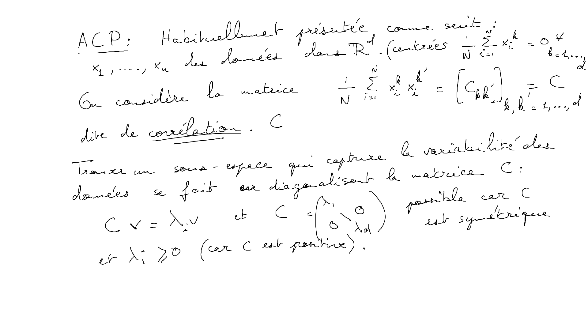
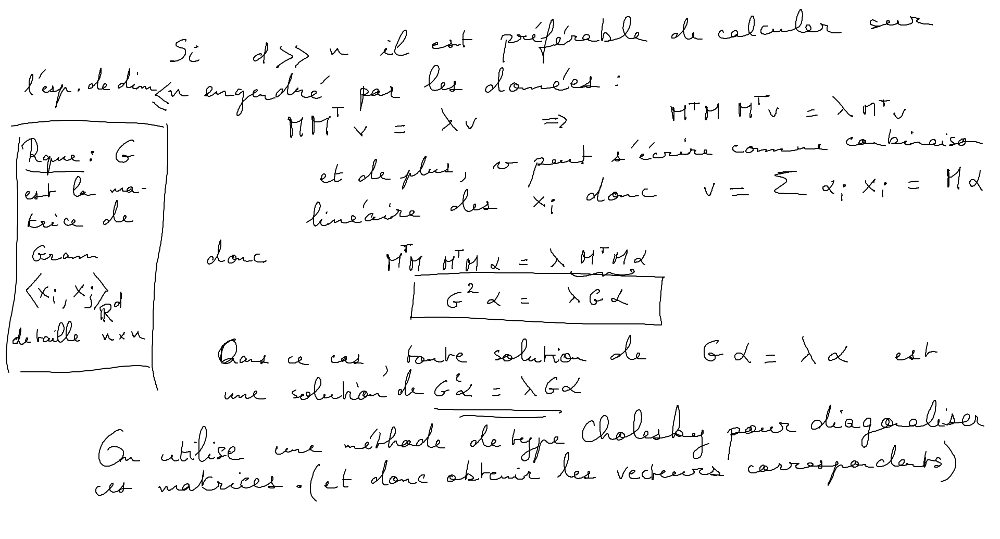
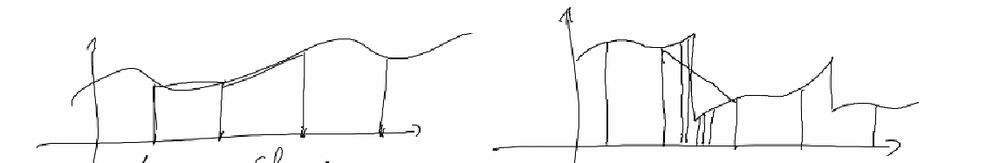
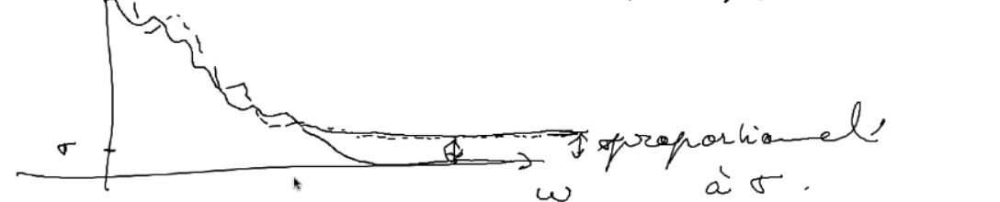
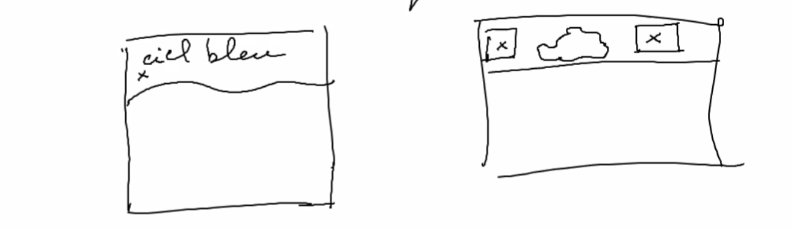
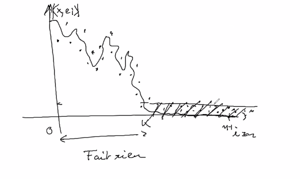
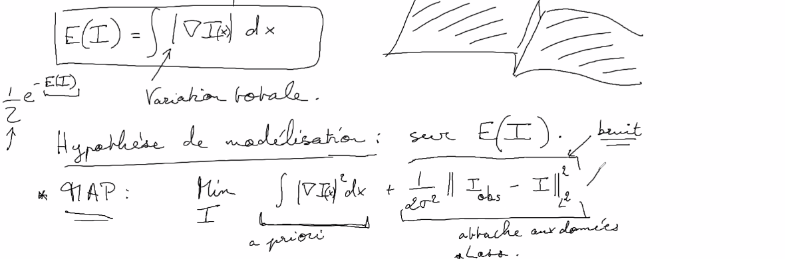

# Débruitage

## Introduction

Problème vieux de plus de 30 ans

- difficultés à améliorer l'état de l'art, les recherches stagnes (possiblement résolu)

On a vu qu'il était possible de créer une décomposition d'un signal (image, son) dans une base de Fourier ou d'ondelettes.

Le choix de la base dans laquelle exprimer le signal est important en fonction du problème abordé (compression, ...)

<u>Le problème:</u>

on dispose d'un signal et d'une observation qui est la composition de ce signal plus du bruit.

On a accès à l'observation mais pas au vrai signal (on ne le connait pas). On ne connait pas non plus le bruit mais on en connait un modèle en général.

opération entre le signal et le plus peut être une simple addition ou une combinaison plus complexe des deux.

<u>Les différentes stratégies:</u> 

Il y a deux points communs entre compression et débruitage : 

- pour la compression le but est de résumer le signal avec un nombre de valeurs plus petites que l'original ($p < n$ ou $n$ est la taille d'origine)
- pour le débruitage le but est de déduire le signal à partir de l'observation (signal plus bruit)
 - le but commun, jeter de la *non information*.

Une base orthonormé du signal (Fourier ou ondelettes)  est une bonne description et va être utile dans ce cadre là.

Soit $e_i$ une autre base (que la base d'acquisition du signal) (ex : ondelettes)

$$
x = \sum_{i=0}^d <x, e_i> e_i
$$

En compression, on prend les premiers vecteurs de la base  $k < d$

$$
x \approx \sum_{i=0}^k <x, e_i> e_i
$$

Si x est régulier, $|<x, e_i>| \leq i^{-\alpha}$ (erreur décroissante)

$||x - \sum_{i=0}^k <x, e_i> e_i ||^2 = \sum_{i=k+1}^\infty |<x, e_i>|^2 \leq \sum_{i=k+1}^\infty \frac{1}{i^{2\alpha}} \approx \frac{\text{cste}}{k^{2\alpha-1}}$

L'idée est de trouver une base dans laquelle la décroissance de l'erreur du signal est rapide ( cela dépend évidemment du signal et le type de donnée)

<u>Plusieurs situations</u> 

1. Pas d'information à priori sur les données ou leur structure, mais on a accès à des échantillons et exemples (base de données)

<u>Analyse en composante principale:</u> (A.C.P.)

Soit  $(d_1, \dots d_M) d_i \in \mathbb{R}$ des vecteurs représentant nos données

Calculer la matrice de gramm $(<d_i, d_j>)_{M^2} = G$

$G$ est une matrice symétrique réelle positive.
Cette matrice est diagonalisable.
l'idée de l'analyse en composant principal est de chercher à représenter les données par une ellipsoïde (fiting par une ellipsoïde )

> Rappel: $M \in \mathbb{R}^{n^2}$
>
> diagonaliser M c'est trouver une base adaptée à $M$, c'est à dire une base dans laquelle M est facile à représenter/calculer.
> $$
> M = \begin{bmatrix}
>     \lambda_{1} & & 0\\
>     & \ddots & \\
>     0 & & \lambda_{n}
>   \end{bmatrix}
> $$
> les $\lambda_i$ sont les valeurs propres de $M$
>
> Toutes mat n'est pas tout le temps diagonalisable
>
> C'est le cas pour les mat symétrique réelle

Il est possible de classer par ordre de décroissance les valeurs propres de la matrice de graam ainsi calculée

On peut alors décider de réduire la dimension de représentation sur $d'$ vecteurs en considérant que les axes que l'on décide d'*oublier* sont des axes *bruités*.

$d_i = \sum_{k=1}^{d'} <d_i, e_k> e_k$ avec $(e_k)$ base donnée par le  S.V.D.

Fondamentalement, cela va sélectionner les directions principales qui encode la plus grande variabilité de nos données pour réduire la dimension de la base qui représente ces données.

2.  On dispose d'informations à priori :

Proba d'observer une image = proba de l'observer translatée

<u>Fourier est une base naturellement adaptée à ce genre de données *invariantes* par translation.</u>

Si on se donne une approximation linaire dans la base de Fourier, c'est équivalent à échantillonner le signal régulièrement (on garde les $k$ premières harmoniques)

En fixant des points d'interpolation/échantillonnage constant on obtient une mauvaise reconstruction à cause des discontinuités potentielles du signal (il peut être régulier par morceaux comme une image en général).

On aimerait une information plus fine au niveau des discontinuités du signal pour avoir une meilleure reconstruction globale de celui-ci.

<u>Idée:</u> avoir une approximation non linaire du signal (adaptive)

► Ex garder les plus grands coefficients et tronquer les autres (considéré comme ayant une faible importance) dans une base adaptée (exemple une base de Fourier)

## Définition du Bruit

modèle de formation de nos données :

$I_\text{observation} \in \mathbb{R}^d = I_\text{idéal} + N$ ($N$ noise ou bruit) 

<u>Hyp:</u> on connait le modèle du bruit (il est possible de l'estimer expérimentalement parfois )

### Bruit gaussien:

$n[i]$ est une variable aléatoire 

$n[i]: \in \Omega \rightarrow \mathbb{R}$

On appelle $p(x)= \mathbb{P}(n[i] \in [x, x +dx])$ la densité de probabilité du bruit

$p(x):= \mathbb{P}(\{\omega; n[i](\omega) \in [x, x +dx]\})$

Exemple de variables aléatoires définissant du bruit:

- Bernoulli : $\mathbb{P}(u[i]=1) = \frac{1}{2} = \mathbb{P}(u[i]=-1)$

- Variable gaussienne : $p(x) = \frac{1}{\sigma\sqrt{2r}} e^{ -\frac{(x-\mu)^2}{\sigma^2}}$

  En général $\mu = 0$  car centré autour de $0$

  de variance $\sigma^2$

En général le bruit qui est défini pour chaque pixels ($n[i]$) mais il est possible d'observer comment varie le bruit par changement de pixels.

> Rappel:  pour x une variable aléatoire
>
> $\mathbb{E}[x] = moyenne = \int_\mathbb{R} xp(x)dx$
>
> $\mathbb{V}ar[x] = \mathbb{E}[x^2] - \mathbb{E}[x]^2 = \mathbb{E}[(x- \mathbb{E}[x])^2]$

Estimer l'espérance d'une variable aléatoire peut se faire assez facilement à partir des données (méthodes non précisée ici)

Pour une photo, moyenner plusieurs échantillons pour moyenner le bruit et réduire la variance (longue exposition)

pour un modèle gaussien $I = a \in \mathbb{R} +n$ ou $n$ est gaussien de variance $\sigma^2$

$$
\frac{1}{N} \sum_{i=1}^N I(\omega_i) \rightarrow a
$$

Modèle de bruit: 

$I = I_{\text{Idéal}} \in \mathbb{R} + \sigma n$

$n$ est un bruit blanc $\in \mathbb{R}^d$

$\mathbb{E}[n(i)n(j)] = \mathbb{E}[n(i)]\mathbb{E}[n(j)]$ (non corrélation)

$\mathbb{V}ar[n(i)] = 1$ et $\mathbb{E}[n(i)] = 0$

Comment se transforme le bruit blanc lorsque l'on change de base ?

il reste un bruit blanc également de même intensité.

$e_i = \sum_{k=1}^d \alpha_{ik} f_k$ avec $f_k$ la base d'acquisition

$$
E[ <e_i, n><e_i, n>] 
&= E[ (\sum_{k=1}^d \alpha_{ik} < f_k,n>) (\sum_{k'=1}^d \alpha_{ik'} < f_{k'},n>)] 
&= \sum_{k, k'}  \alpha_{ik}  \alpha_{jk'} E[<f_k, n><f_{k'}, n>] 
&= \sum_k \alpha_{ik} \alpha_{jk} = <ei, ej> = \delta_{i=j} 
$$

Conclusion: le bruit est présent à toutes les fréquences (de la même manière)

non corrélation avec la base de représentation

L'idée du débruitage est donc par changement de base de mettre en évidence le bruit pour pouvoir ensuite le supprimer (hard thresholding des fréquences par exemple)

--- 
En général un débruiteur invariant par translation est meilleur

$L(x) = \sum_{i=1}^M l_i<x, e_i>e_i$

oui $e_i$ est une base de fourrier

minimiser AMS (average means square ) 

$$
AMS = \frac{\mathbb{E}[||L(x_0+n)-x_0||^2]}{||x_0||^2}\\ 
&= \frac{\mathbb{E}[||\sum_{i=1}^M (l_i<x_0, e_i>-<x_0,e_i)e_i||^2}{\sum_{i=1}^M l_i<x_0, e_i>e_i} \\\frac{\mathbb{E}[\sum_{i=1}^M ((l_i-1)<x_0, e_i>+<x_0,e_i)l_i)^2}{\sum_{i=1}^M <x_0, e_i>^2}
$$

Discussion sur les $l_i$:

On suppose que le signal $x_0$ est bien décrit pour ses $N$ premiers coefficients:

$L(x)= P(x):= \sum_{i=1}^N <x, e_i>e_i$

donc  $l_i = 0 \quad \forall i \geq N +1$

$l_i = 1 \quad\forall i \leq N$

$$
AMS = \frac{\mathbb{E}}{||x_0||^2} \left[\sum_{i=1}^N (<n, e_i>)^2 + \sum_{i=N+1}^M (<n, e_i>)^2 \right]
$$

->variance :

$$
\mathbb{E}\left[ \sum_{i=1}^N (<n, e_i>)^2 \right] = N\sigma^2
$$

biais de modèle : $||p(x_0)-x_0||^2$

$$
AMS = (||p(x_0)-x_0||^2 + N\sigma^2)\frac{1}{||x_0||^2}
$$

problème : si on tue les hautes fréquences (pour enlever le bruit), on floute les discontinuités et détails de l'image.

conclusion : une méthode non linéaire n'est pas assez satisfaisante du point de vue visuel

<u>méthode non linéaire</u>: hard/soft thersholding 

​	$L_x = \sum_{i=i}^M S_T(<x, e_i>)e_i$

ou $S_T$ est une fonction de $\mathbb{R}$ dans $\mathbb{R}$ avec:

$$
S_T(x) = \left\{
\begin{array}{rl}
x &:\; x > |T|  \\ 
0 &:\; \text{sinon} \\
\end{array}
\right.
$$

> le soft qui lisse la courbure de coupure .

---

Les débruiteurs "doivent"

- être invariants par translation pour être performants.
- Convolution (débruiteur linéaire) c'est esquivaient
- Est-ce que le soft/hard thersholding dans la base de fourrier est equivalant ?

Oui c'est bien invariant:

$$
L(I) = \sum_{i=i}^M S_T(<I, e_i>)e_i \\
L_°\Tau_a(I) =  \sum_{i=i}^M S_T(<\Tau_a(I), e_i>)e_i \\
<\Tau(I), e_i> = \int e^{-2i\pi ku}\Tau_a(I(u))d_u = e^{-2i\pi ku}<I, e_k> \\
$$

ça a le même module que 

$$
S_T(<I, e_i>)e_i = S_T(<\Tau_a(I), e_i>)e_i
$$

Les ondelettes ne sont pas invariants par translation:

<u>Cycle-spinning :</u>

on moyenne notre debruitage sur un espace de translation :

$$
L(I) = \frac{1}{|\Delta|}\sum_{t\in\Delta} \Tau_{-t} L(\Tau_{t}(I))
$$

---

En pratique (estimation de la variance):

on considère $\Phi(I_{obs}) \rightarrow (P_{8\times8})_{i \in I}$

$\Phi$ est la fonction d'"extraction" des patches
un pixel appartient à en théorie $64=8.8$ patches $P$

Estimation de la variance:

Soit $P$ un patch :

$var(P) = \frac{1}{m}\sum_{k=1}^m(p_k-moy(P))^2$

$moy(P) = \frac{1}{m}\sum_{k=1}^m p_k$

Idée : le bruit et sa variance vont être facilement estimés sur des patches de petite variance.

L'idée est de sélectionner les patches de variance minimale pour en faire la moyenne (car ils présente,t peu de discontinué (variance élevée))

on map l'image sur ses patches, on calcule leurs variances, on regarde la distribution de la variance des patches pour en sélectionner ceux donc la variance est faible.

-> on fait la moyenne des patches donc la variance est petite.

--- 

<u>Les méthodes à l'état de l'art:</u>

- Les ondelettes sont plus efficaces en terme de localisation des discontinuités que par Fourier
- Les premières méthodes utilisaient la DCT

$I \rightarrow P_{8\times8} \rightarrow^{DCT} \text{Hard thersholding} \rightarrow^{DCT^{-1}}$

Soit $L$ le débruiteur défini par :

$L(I)(x) = \frac{1}{\#P}\sum_{x\in P} FT^{-1}(S(FT(P)))(x)$

où $\#P$ est le nombre de patches auxquels $x$ appartient et $P$ les patches auquel $x$ appartient et $S$ me soft ou hard thresholding

> on peut améliorer la moyenne en excluant les valeurs extrêmes

$\rightarrow$ LE "meilleur" débruitage en utilisant cette méthode + du multi-échelle est à -8.5dB par rapport à l'état de l'art (autrement dit, elle performe moins bien que la meilleurs des méthodes existantes)

- Pousser la non linéarité plus loin

Idée: on observe des échantillons/réalisations pour en faire la moyenne (mais on ne dispose pas de ces multiples réalisations)

mais comment avoir accès à ces réalisations aléatoires ?

 $\int\frac{1}{Z}e^{\frac{||x-u||^2}{2\sigma^2}}I(y)d_y$

- considérer les pixels voisins n'est pas toujours les meilleurs candidats à être un modèle proche d'un nouvelle réalisation considérée, il faut donc aller les chercher ailleurs .

- filtre bilatéral (première utilisation de cette technique):

$l(x)$ est remplacé par une moyenne des pixels de $I(y_i) $avec $y_i \in \text{Voisinage}(x)$ ou $\text{Voisinage}(x) = \{ y_i, |y_i-x|^2+|I(y_i)-I(x)|^2 \leq \mathbb{R}\}$

Finalement, comment étendre la notion de proximité des pixels ?

Plutôt que de prendre un filtre gaussien dans l'espace des patches plutôt que dans l'espace spatial des pixels

méthode NLmeans (non local means)

---

<u>soft-hard threshlding:</u>

on considère un signal dans une base adéquate (comme ondelette ou Fourier)

Soit $S_T(x) = \sum_{i=1}^N s_T(<x,e_i>)e_i$

avec $s_T(y) = 1_{(y\geq T)}\times y$ pour le hard thresholding

On agit de manière non linéaire sur les coefficients du signal

<u>Non locals means :</u>

$I_{\text{obs}} \rightarrow (p_i)_{i\in I}$

filtre gaussien sur les patch $P_i$ en ayant connaissance du bruit d'input

$$
\frac{\sum_j P_je^\frac{-||P_j-P_i||^2}{2\sigma^2}}{\sum_j e^\frac{-||P_j-P_i||^2}{2\sigma^2}}
$$

$\forall x \in \text{grille de pixel}$

$I(\text{estimé}) = \text{Moyenne}_{x \in P_i}(\hat P_i(x))$

l'enjeu est d'optimiser le temps de calcul dans la sélection des patchs de l'image

---

<u>NLM (approche bayésienne):</u>

On considère sur les patches un modèle de bruits (le plus proche possible de ce que l'on observe)

Soit $P,Q$ deux patches ($8\times8$), de $\sigma > 0$ connus

$Q$ étant notre image idéale et $P$ l'image bruité observée avec un bruit $n$ gaussien

$P = Q +n$ ou $p(n) = \frac{1}{Z}e^\frac{-||P-Q||^2}{2\sigma^2}$

$$
\mathbb{P}(I_\text{idéal}|I_\text{obs}) = \mathbb{P}(P|Q) = \frac{1}{Z}e^\frac{-||P-Q||^2}{2\sigma^2} = g_\sigma(P-Q)
$$

ou $Z$ est un coefficient de normalisation

Si on a $\mathbb{P}(I_\text{idéal}|I_\text{obs})$:

MSE :
$$
\mathbb{E}[I_\text{idéal}|I_\text{obs}] = \int I_\text{idéal}e^{-d^2(I_\text{idéal}-I_\text{obs})} p(I_\text{idéal})dI_\text{idéal}
&= \mathbb{E}[I|I_\text{obs}] = \int I_\text{idéal}e^{\frac{-||I_\text{obs}-I||^2}{2\sigma^2}} p(I)dI
$$

Approche du type : maximum à posteriori (MAP)

on cherche à maximiser le $log\quad\mathbb{P}(I_\text{idéal}|I_\text{obs})$

$$
max\quad log[I_\text{idéal}e^{\frac{-||I_\text{obs}-I_\text{idéal}||^2}{2\sigma^2}} -log\mathbb{P}(I_\text{obs})]\\
<=> \\
min\quad log\mathbb{P}(I_\text{obs}) + \frac{1}{2\sigma^2}||I_\text{obs}-I_\text{idéal}||^2
$$

On peut en pratique postuler un modèle pour $log\mathbb{P}(I_\text{obs})$ par régularisation (proposé dans les années 90's 2000's) (régularisation de sobolev):

$$
E(I) = ... log\mathbb{P}(I_\text{obs}) = \int||\nabla I||^2dxdy
$$

ou $\nabla I(x, y) = (\frac{\partial}{\partial x}I,\frac{\partial}{\partial y}I )$

il existe aussi la régularisation totale...

Le problème est de savoir minimiser une fonction dans un espace de grande dimension $\mathbb{R}^d$ ou $d >>1$ d: le nombre de pixels

  

Hypothèse de modélisation:

MAP : $\frac{Min}{I} \quad \int||\nabla I||^2dxdy \quad+\quad \frac{1}{2\sigma^2}||I_\text{obs}-I_\text{idéal}||^2$

$\frac{Min}{I}$ = (a priori) + (attache aux données)

$\frac{Min}{I}$ = (Reg($I$) + attache($I$, $I\text{obs}$)
